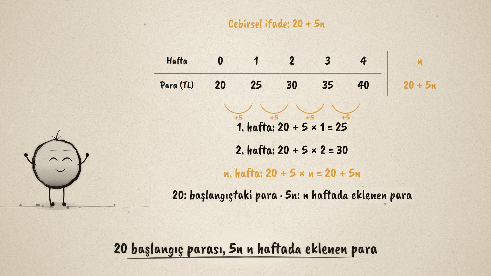
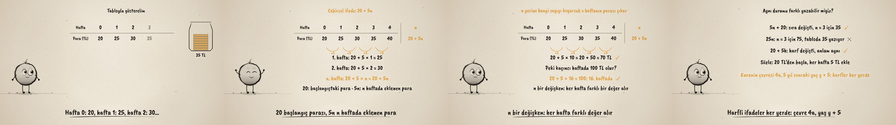

# Harfle Anlat · From Known to Unknown

**▶ Tarayıcıda izleyin / Watch in the browser:** https://hakanatas.github.io/harfle-anlat/ 
**⬇ MP4 + altyazılar / MP4 + subtitles:** [Releases](https://github.com/hakanatas/harfle-anlat/releases) 
**✎ Kullanılan istem / The prompt behind it:** [PROMPT.md](PROMPT.md) 
**🎞 Bütün filmler / All films:** [Nokta'nın Filmleri](https://hakanatas.github.io/nokta-filmleri/?sinif=6)

> **TR —** 6. sınıf matematik "İşlemlerle Cebirsel Düşünme ve Değişimler" temasındaki MAT.6.2.1 öğrenme çıktısı için hazırlanmış, tamamen JavaScript ile çizilen 92 saniyelik mürekkep animasyonu. Nokta'nın kumbarasında 20 TL var ve her hafta 5 TL ekleniyor. Bilinen ve bilinmeyen nicelikler ayrılıyor, hafta ve para bir tabloya yazılıyor; hafta 1 artınca para 5 artıyor. Hafta sayısına n denince durum cebirsel olarak yazılıyor: 20 + 5n (20 başlangıç parası, 5n n haftada eklenen para). Varsayımlar ifadeyle sınanıyor: 10. haftada 70 TL, 100 TL'ye 16. haftada. Aynı durum farklı yazılıyor: 5n + 20 aynı, 20 + 5h aynı anlam, 25n ise tabloyla uyuşmuyor. Son olarak cebirsel ifadelerin başka yerlerdeki kullanımı: karenin çevresi 4a, 5 yıl sonraki yaş y + 5. Altyazılar Türkçe, İngilizce ya da ikisi birlikte seçilebilir.

A 92-second ink animation for **6th-grade maths**, the first film of the second 6th-grade theme. Nokta, the ink character from [The Learning Ink](https://github.com/hakanatas/the-learning-ink), is the guide again, this time with a savings jar whose coins drop in one per week as the table fills.

## Learning outcome

MEB, Türkiye Yüzyılı Maarif Modeli, Ortaokul Matematik, 6th grade, "İşlemlerle Cebirsel Düşünme ve Değişimler" theme:

**MAT.6.2.1. Gerçek yaşam durumlarında bilinen niceliklerden bilinmeyen niceliklere ilişkin muhakeme yapabilme**
- a) Gerçek yaşam durumlarında nicelikleri belirler.
- b) Nicelikler arasındaki ilişkileri tablo temsili kullanarak belirler.
- c) Nicelikler arasındaki ilişkileri cebirsel olarak ifade eder.
- ç) Cebirsel ifadenin anlamını kendi cümleleri ile açıklar.
- d) Yorumladığı cebirsel ifadelere karşılık gelen durumlara yönelik varsayımda bulunur.
- e) Verilen cebirsel ifadelere yönelik varsayımda bulunduğu durumları inceleyerek değişkenlerin ve cebirsel ifadelerin anlamlarına yönelik genellemeleri belirler.
- f) Elde ettiği genellemelerin varsayımını karşılayıp karşılamadığını farklı sözel ve cebirsel ifadeler ile sınar.
- g) Doğrulayabileceği sözel ve cebirsel ifadeleri farklı değişken ve değerlerle sözel ve cebirsel olarak yeniden ifade eder.
- ğ) Cebirsel ifadelerin matematiğin farklı alanlarında ve gerçek yaşam durumlarında kullanımına yönelik katkısını ifade eder.

## Scenes

| # | Time | Scene | What happens | Outcome |
|---|---|---|---|---|
| 1 | 0–10 s | Kumbara | 20 TL in a jar, 5 TL more every week: what is known, what is unknown. | a |
| 2 | 10–30 s | Tablo | Weeks 0–4 and money 20–40 TL; each week adds 5. | a, b |
| 3 | 30–48 s | Cebirsel ifade | 20 + 5 × 1, 20 + 5 × 2, … 20 + 5n; what 20 and 5n mean. | c, ç |
| 4 | 48–66 s | Varsayım | Week 10 gives 70 TL; 100 TL comes in week 16; n is a variable. | d, e |
| 5 | 66–80 s | Farklı yazılışlar | 5n + 20 works, 25n fails (75 ≠ 35), 20 + 5h means the same; in words; 4a and y + 5 elsewhere. | f, g, ğ |
| 6 | 80–92 s | Aklında kalsın | Known and unknown, a table, an expression, checking with values. | a–ğ |

## Running it

- **Preview:** double-click `index.html` (it works offline).
- **MP4:** run `npm install` once, then `npm run export -- --format=horizontal --captions=tr`.
- **Subtitles and narration:** `npm run srt` writes `out/captions_*.srt` and `narration_notes.txt`.
- **Editing:**
  - Caption text, timings and narration notes: `captions.js`
  - Everything on screen is drawn by `LI.world(t)` in `scenes/scene1.js` (the jar, the table and its n column, the checks); the other scenes only set the camera.
  - The jar, fractions and Nokta's poses: `src/draw/film.js`; layout for 16:9 and 9:16: `src/draw/kd.js`

It uses the same engine as The Learning Ink: `renderFrame(t)` as a pure function of time, seeded randomness, and frame-by-frame export.
